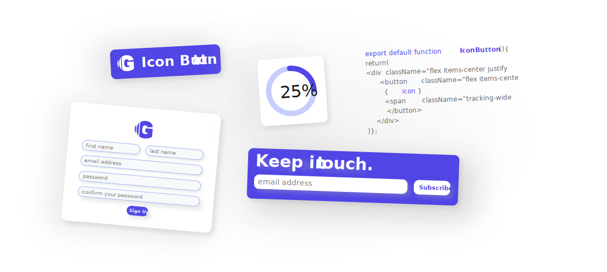

## Arthur Fincham

### I’m Arthur, a recent graduate from Maker’s Academy.

Since I finished university in May 2021, working on Ruby and Javascript, I’ve been practicing my coding skills everyday to prepare myself for a role as a **Full Stack Engineer**.

At the moment my focus is on **React**; making an effort to challenge myself and learn more everyday.

I love tech as it is an ever-changing and exiciting field. As a naturally good communicator, I’d love to join a team that collaborates to deliver impactful projects.

### Currently working on:

### [Gust](https://gust-six.vercel.app/)

A component library for React and Tailwind CSS.

_Please see some of my other favourite projects below:_
